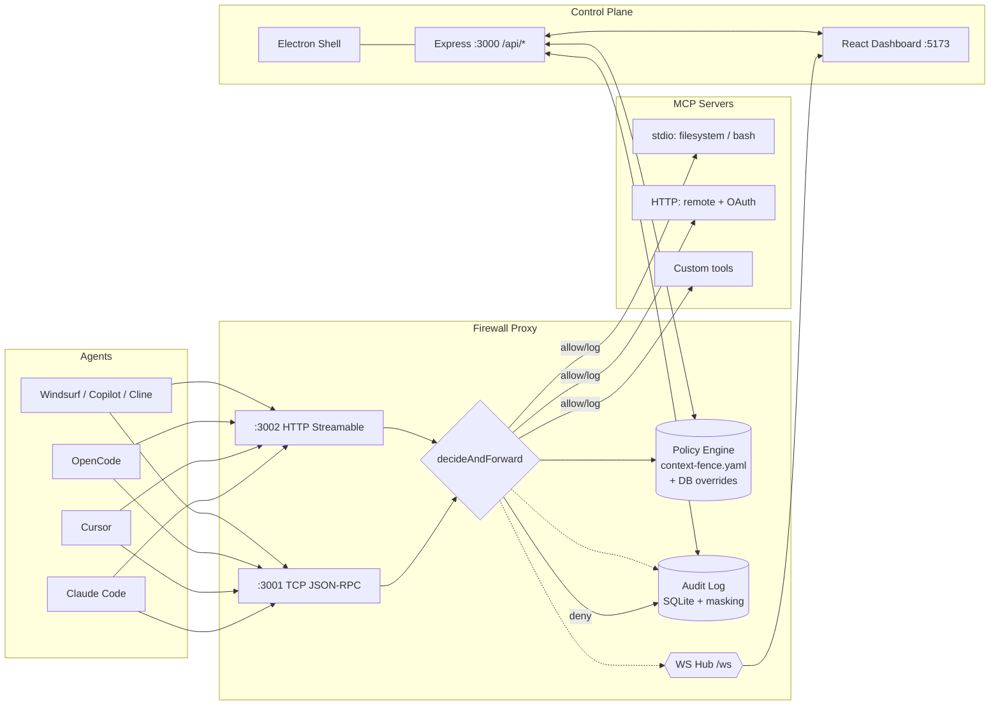
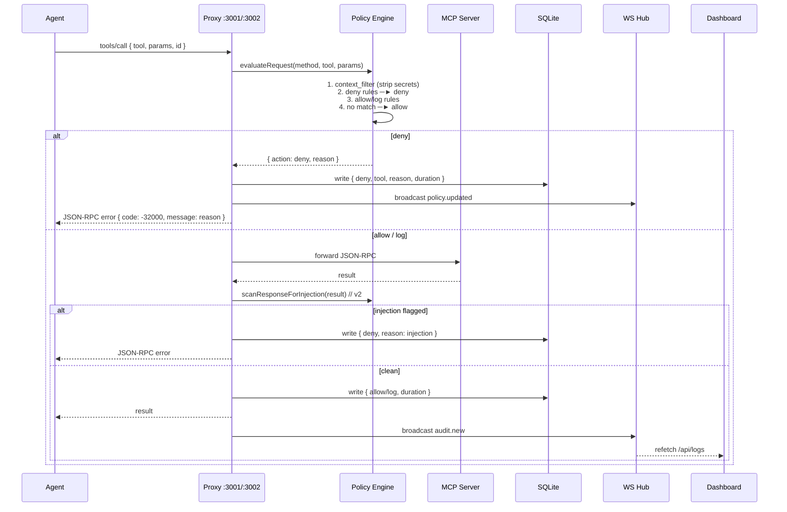
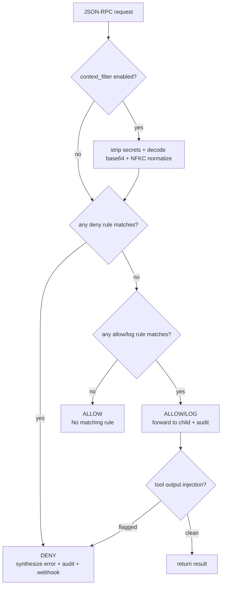

# Context Fence — MCP Firewall (v2.0.0)

> **Local-first security control plane for AI coding agents.** Every MCP tool call is intercepted, policy-checked, and audited — before it reaches your tools.

[](https://contextfence.dev/downloads)
[](https://contextfence.dev/downloads)
[](#license)
[](https://contextfence.dev/downloads)

**Get it:** **[contextfence.dev/downloads](https://contextfence.dev/downloads)** — v2.0.0 for macOS (universal dmg), Windows (x64 NSIS), and Linux (AppImage / deb / rpm)

---

## Table of Contents

- [Why Context Fence](#why-context-fence)
- [Architecture](#architecture)
- [How a Request Flows](#how-a-request-flows)
- [Features](#features)
- [Installation](#installation)
- [Quick Start (Developers)](#quick-start-developers)
- [Policies](#policies)
- [Dashboard](#dashboard)
- [API Overview](#api-overview)
- [Repository Layout](#repository-layout)
- [Tech Stack](#tech-stack)
- [Verification & Testing](#verification--testing)
- [Roadmap](#roadmap)

---

## Why Context Fence

AI agents (Claude Code, Cursor, OpenCode, Copilot, Cline, Windsurf, etc.) execute tools via **MCP servers** — file writes, shell commands, HTTP fetches. Without a firewall, a single hallucinated `rm -rf` or a prompt-injected `fetch(OPENAI_API_KEY)` runs unchecked.

Context Fence sits **between** the agent and every MCP server as a transparent proxy. No agent code changes — just point the agent at `localhost:3001` and every call is evaluated.

```
Agent ──► Firewall Proxy ──► MCP Server
           │  ├─ Policy Engine (YAML + SQLite overrides)
           │  ├─ Audit Log (SQLite, secret-masked)
           │  └─ Dashboard API + WebSocket
           └─► Dashboard (React) ◄── Electron Shell
```

---

## Architecture



**Ports:**

| Port | Purpose | Stable? |
|------|---------|---------|
| `3001` | TCP JSON-RPC ingress (stdio agents) | Yes — agents point here |
| `3002` | HTTP Streamable ingress (remote agents) | Yes |
| `3000` | REST API + WS hub (`/ws`) — random in packaged app, `3000` in dev | Dev only |

---

## How a Request Flows



**Policy evaluation order:** `deny` always beats `allow`/`log`. Rules match on `methods[] + tools[] + param_contains[] + path_patterns[] + domain_patterns[]`. Context filter strips 11 secret patterns (API keys, `sk-`, `ghp_`, PEM, `Bearer`/`JWT`, env refs) before matching.

---

## Features

| Area | What it does |
|------|--------------|
| **MCP Proxy** | Intercepts every JSON-RPC method (`tools/call`, `initialize`, etc.), rejects batch requests, synthesizes deny errors, buffers child stdout until ready (8–10 s), 30 s abort on HTTP |
| **Policy Engine** | YAML rules (`action: allow/deny/log`), case-insensitive tool match, `param_contains` + regex `path_patterns`/`domain_patterns`, base64-decode, NFKC unicode normalization, hot-reload via `chokidar`, `log_only` downgrade |
| **Built-ins** | Destructive file ops, DB drops, secret exfil via `http_request`/`fetch`, `file:`/`javascript:` navigation, file-system log, default allow |
| **v2 Additions** | Domain allowlist, tool-output injection scanner, secret-strip for Slack/AWS keys, 256 KB batch limit, HTTP keep-alive reuse |
| **Audit Log** | Every decision with tool/server/agent/reason/duration/timestamp, secret-masked + 50 KB truncated, retention job (60 s interval), CSV/JSON export, indexed by `timestamp`/`tool` |
| **Agent Detection** | 10 agents: Cursor (incl. 0.45), Claude Desktop/Code, OpenCode, Codex, Copilot, Cline, Continue, Windsurf, Aider — parses DBs + JSONL + workspace files |
| **Dashboard** | KPI cards (Agents, Connectors, Calls Audited, Policy Decisions), AreaChart (allow/deny/log), doughnut + traffic pie, Recent Activity, Firewall topology, Threats grouped by rule, AgentDetail |
| **Realtime** | WS hub on `/ws` broadcasts `policy.updated` / `audit.new` / `agent.updated` (signal-only), heartbeat ping every 25 s, deduped broadcasts |
| **Electron** | `contextIsolation: on`, `sandbox: on`, spawns backend as detached group, health-wait, random API port in prod, auto-update interval (`CF_UPDATE_INTERVAL_MS`), backend crash retry with backoff, side-by-side bundle id `app.contextfence.v2.desktop` |
| **Security** | Rate limiter (100 req/min), CORS `*` in dev, SQLite WAL, better-sqlite3 prebuild pinned for Node 22, `ulimit -n 4096` wrapper on macOS |

---

## Installation

> **Primary source: [contextfence.dev/downloads](https://contextfence.dev/downloads)** — signed assets + sha256 + sizes + changelog.

### macOS (Homebrew — recommended)

```bash
brew tap aditya-ig10/context-fence
brew trust --cask aditya-ig10/context-fence/context-fence
brew install --cask context-fence
```

Ad-hoc signed — cask clears quarantine. First launch ~10 s (backend boot). Full friend-safe guide: [INSTALL.md](INSTALL.md).

### Windows

1. Download `Context-Fence-Setup-2.0.0-x64.exe` from **[contextfence.dev/downloads](https://contextfence.dev/downloads)**
2. Run it → SmartScreen **More info → Run anyway** (per-user install, no admin)
3. Installer preserves data on upgrade (`deleteAppDataOnUninstall: false`)

### Linux

AppImage / deb / rpm on the same downloads page. Or run the backend directly via Node (see Quick Start).

### Updating

- **In-app:** Settings → Updates → Check for Updates (notify-only, never auto-installs)
- **Homebrew:** `brew update && brew upgrade --cask context-fence`
- **Windows/Linux:** re-download from [contextfence.dev/downloads](https://contextfence.dev/downloads)

Data (audit log, policies, connectors) is kept on upgrade at `~/Library/Application Support/Context Fence` (macOS) / `%APPDATA%` (Windows).

---

## Quick Start (Developers)

Requires **Node ≥ 20**.

```bash
# 1. Backend — API on :3000, proxies on :3001/:3002
cd backend
npm install
npm run dev          # tsx watch src/index.ts
# or: npm run build && npm start

# 2. Frontend — dashboard on http://localhost:5173
cd frontend
npm install
npm run dev

# 3. Optional — seed demo agents
cd backend && npx tsx src/scripts/seed.ts

# 4. Mock MCP server for tests
cd backend && node scripts/mock-mcp-server.mjs
```

Point any agent's MCP server URL to `http://localhost:3001` (or `:3002` for `type: remote`). The proxy forwards to real servers registered via Dashboard → Connectors / TestMCP.

**Env overrides** (see [.env.example](.env.example)):

```bash
PORT=3000
CF_PROXY_PORT=3001
CF_PROXY_HTTP_PORT=3002
CF_DATA_DIR=./data
CF_POLICY_DIR=./
CF_RATE_LIMIT_PER_MIN=100
CF_PROXY_TIMEOUT_MS=30000
CF_PROXY_BATCH_LIMIT_KB=256
CF_UPDATE_INTERVAL_MS=21600000
```

---

## Policies

Rules are plain YAML — `backend/context-fence.yaml` ships defaults, GUI overrides live in SQLite (`custom_policies`, origin: Built-in / Modified / Custom). YAML is never rewritten; overrides replace in-memory.

```yaml
rules:
  - name: block-destructive
    action: deny
    reason: Destructive command blocked
    methods: [tools/call]
    tools: [execute_command, bash]
    param_contains: [rm -rf, "dd if"]

  - name: allow-trusted-domains   # v2
    action: allow
    methods: [tools/call]
    tools: [http_request, fetch]
    domain_patterns: ['^api\.trusted\.com$', '^cdn\.example\.org$']

  - name: log-filesystem
    action: log
    methods: [tools/call]
    tools: [read_file, write_file, list_directory]
```

**Evaluation:**



- `tools[]` matched case-insensitive
- `param_contains` — substring in any stringified arg
- `path_patterns` / `domain_patterns` — regex on file paths / HTTP hosts
- Hot-reload: `chokidar` watches `CF_POLICY_DIR`

---

## Dashboard

- **KPI row:** Agents Detected · MCP Connectors · Calls Audited · Policy Decisions (AreaChart with `allow`/`deny`/`log`, period `today`/`7d`/`30d`)
- **Bottom:** Recent Activity (10 latest) + Connector Status (doughnut) + Traffic Share (pie, filtered to registered servers only)
- **Firewall page:** Enforcement doughnut, node topology, top threats grouped by rule with expandable historical variants
- **Other pages:** Agents, AgentDetail (node utilization graphs), AuditLog (filters + CSV export), Policies (live edit), TestMCP (connection test + OAuth), Settings (retention presets, theme, log-only, webhook), Profile

**Data layer:** `useCachedFetch` — stale-while-revalidate + `sessionStorage` mirror — 60 s default, 15 s for policies/logs. `useRealtimeSync` refetches on WS events. Invalidation via `invalidateCache`.

**Design:** InsightHub editorial (warm gray, white 26 px cards, hairline borders, coral→teal→white rhythm, count-up numbers) + liquid-glass for floating surfaces (sidebar, toasts, tooltips). See [design.md](design.md).

---

## API Overview

All JSON under `/api` (Vite proxies to `:3000` in dev).

| Route | Purpose |
|-------|---------|
| `GET /api/health` | `{ ok: true, ts }` |
| `GET /api/stats` ` /timeline?period=` ` /mcp-usage` ` /health-radar` | KPIs, buckets, byServer, 5-axis radar |
| `GET/POST /api/policies` ` /:name/override` ` /restore` ` /import` | Merged list, create/override/delete |
| `GET /api/logs?limit=&from=&to=` ` /export` | Audit query + CSV export + retention |
| `GET/PUT /api/settings/:key` | Typed store (theme, retention, webhook, log_only) |
| `GET /api/agents` ` /api/detect` | Registered + detected agents |
| `GET /api/firewall/summary` ` /threats/timeline` | Enforcement totals, threats grouped |
| `GET/POST /api/servers` ` /:name/oauth/*` ` /test` | Registry (stdio/HTTP), OAuth, tool discovery |
| `WS /ws` | `policy.updated` `audit.new` `agent.updated` `ping` |

---

## Repository Layout

```
.
├── backend/                 Express :3000 + Proxy :3001/:3002 + Policy Engine
│   ├── src/index.ts         Bootstrap, route mount, retention job, SPA serve
│   ├── src/mcp/proxy.ts     TCP+HTTP proxy, decideAndForward, spawnMcpServer, Framer
│   ├── src/mcp/framer.ts    JSON-RPC framing
│   ├── src/policy/engine.ts evaluateRequest, scanResponseForInjection, masking
│   ├── src/policy/loader.ts loadPolicyFromDisk, validatePolicy  (v2)
│   ├── src/policy/masking.ts maskSecrets                          (v2)
│   ├── src/middleware/rateLimiter.ts  100/min sliding window       (v2)
│   ├── src/db/index.ts      SQLite WAL, audit_log indexes
│   ├── src/routes/          stats, policies, logs, firewall, agents, servers, …
│   ├── src/realtime/hub.ts  WS broadcast + heartbeat + dedupe
│   ├── src/agent-det/       10 adapters (cursor, claude-code, etc.)
│   ├── src/protect/rewriter.ts  config rewrite to :3002 + backup/restore
│   ├── context-fence.yaml   Built-in rules
│   └── test/                adversarial, concurrency, playwright suites
├── frontend/                Vite + React 19 + Recharts
│   ├── src/pages/           Dashboard, Firewall, Policies, AuditLog, …
│   ├── src/components/      Layout (glass sidebar), Charts, Doughnut, Toasts
│   ├── src/hooks/           useCachedFetch, useRealtimeSync
│   ├── src/lib/             api, auth, firebase, theme, dataCache (v2)
│   └── src/styles.css       Design tokens (light + Dark 2.0)
├── electron/                Desktop shell
│   ├── main.js              Spawn backend, health-wait, OAuth, updates
│   ├── preload.js           contextIsolation bridge
│   ├── updates.js           notify-only version check
│   └── build-mac.sh         universal dmg
├── scripts/                 release-all.sh, release-manifest.mjs
├── .github/workflows/       linux-release.yml, windows-release.yml, sync-release-manifest.yml
├── release.json             Manifest consumed by contextfence.dev/downloads
├── design.md                Design system source of truth
└── INSTALL.md / RELEASE.md  Install + maintainer release guide
```

---

## Tech Stack

- **Backend:** Node 20+ ESM + TypeScript, Express 4, better-sqlite3 9.2.2 (pinned for Node 22), `ws`, `js-yaml`, `chokidar`, `tsx`
- **Frontend:** React 19, Vite, react-router, recharts, framer-motion, lucide-react
- **Desktop:** Electron (sandbox + contextIsolation, no nodeIntegration), electron-builder (universal dmg, NSIS)
- **Auth:** Firebase (Google/Apple/email) + Firestore `users/{uid}` — optional, mock session in dev; Electron `window.electronAuth` bridge
- **Styling:** Hand-rolled CSS tokens, no UI framework — cream light + neon dark

---

## Verification & Testing

```bash
# Unit
cd backend && npm test          # framer.test.ts + mcp-fetch.test.ts + rateLimiter.test.ts  (26+)

# Typecheck
cd backend && npx tsc --noEmit
cd frontend && npx tsc -b

# Manual harnesses (14 suites, run individually)
cd backend && npx tsx test/e2e-harness.ts
cd backend && npx tsx test/adversarial-bypass.ts
cd backend && node test/concurrency-v2.test.ts   # v2 100 parallel
```

Playwright suites (`backend/n*-verify.mjs`, `gp*-*.mjs`) exercise the live stack: chart rendering, tooltip values vs raw SQL, dark-mode computed styles, policy override round-trips, cache staleness.

---

## Roadmap

- v2 control plane: encrypted audit sync, team policy management, central dashboard (planned)
- Linux deb/rpm + Docker/Helm (waitlist on site)
- Billing/SSO (Teams/Enterprise)
- Signed + notarized builds

---

## License

MIT — see `electron/package.json` `license`. Audit log, policies, and connectors remain on-device; no telemetry leaves the machine unless you configure a webhook.

**Downloads & changelog:** **[contextfence.dev/downloads](https://contextfence.dev/downloads)** — every release ships from `aditya-ig10/context-fence-releases` with sha256 + changelog generated from `git log`.

